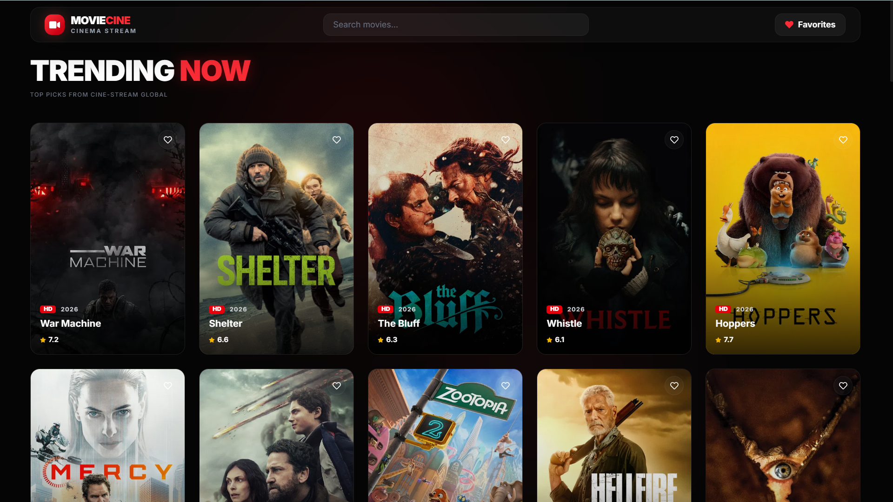
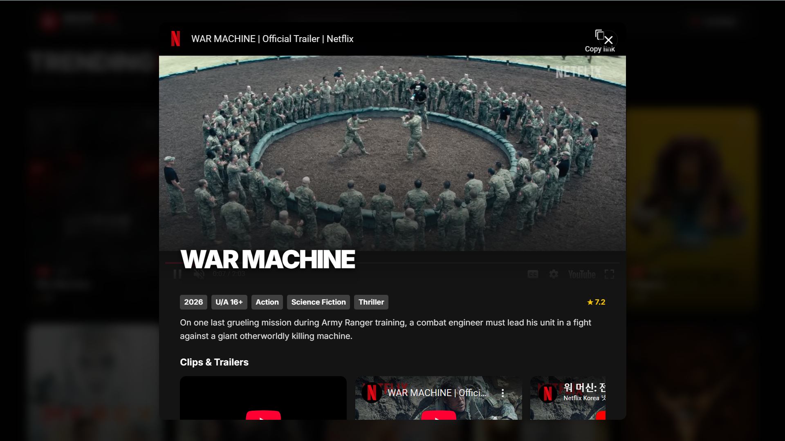

# 🎬 Movie-Cine — The Ultimate Movie Discovery Experience

[](https://movie-cine-using-next-js-b17d.vercel.app/) 


Movie-Cine is a premium, high-performance movie discovery application built with **Next.js 15**. It leverages **Server-Side Rendering (SSR)** for lightning-fast initial loads and **SEO optimization**, ensuring that movies and their details are easily discoverable by search engines.

---

## 📸 Screenshots


<p><i>Modern Glassmorphism UI with Ambient Background Lighting</i></p>


<p><i>Cinematic Detail Pages with Integrated YouTube Trailers</i></p>

---

## ✨ Key Features

- **🚀 Server-Side Rendering (SSR)**: Popular movies are fetched directly on the server for instant page delivery and optimal SEO.
- **💎 Premium Design**: A modern, cinematic "Glassmorphism" aesthetic with custom animations and ambient background glow.
- **⚡ Performance Optimized**:
  - **Hover Prefetching**: Detailed movie data (trailers) starts loading the moment you hover over a card.
  - **Infinite Scroll**: Seamlessly browse thousands of movies with automatic pagination.
- **🔍 Advanced Search**: Real-time searching with **debouncing** to reduce API calls and improve performance.
- **❤️ Favorites System**: Save your favorite movies to a persistent list (stored in LocalStorage) that updates in real-time across the navbar.
- **📱 Responsive Design**: Fully optimized for mobile, tablet, and desktop viewing.
- **🔗 Persistent Modals**: URL-based modal state management ensures that movie trailers stay open even after a page refresh.

---

## 🛠️ Technology Stack

- **Framework**: [Next.js 15 (App Router)](https://nextjs.org/)
- **Styling**: [Tailwind CSS v4](https://tailwindcss.com/)
- **Icons**: [React Icons (FontAwesome)](https://react-icons.github.io/react-icons/)
- **API**: [TMDB (The Movie Database)](https://www.themoviedb.org/)
- **State Management**: React Context (for Global Favorites)

---

## 🧪 Testing Architecture

This project implements a robust automated testing suite to ensure UI reliability and prevent regressions. It utilizes **Jest** as the test runner and **React Testing Library (RTL)** for component rendering in a simulated JSDOM environment.

Key testing features include:
- **Simulated User Interactions**: Utilizing `@testing-library/user-event` to type in search bars and click buttons exactly as a user would.
- **RTL Selection Queries**: Robust element selection using accessibilty-first queries (`getByRole`, `getByText`).
- **Next.js Router Mocking**: Full mocking of `next/navigation` hooks (`useRouter`, `useSearchParams`) to test navigation-dependent components like the Navbar.
- **API Fetch Mocking**: Intercepting and mocking global `fetch` requests (e.g., TMDB API calls on movie card hover) to ensure tests do not rely on external networks.
- **State Provider Wrapping**: Injecting global React Context (`FavoritesProvider`) directly into the testing tree to verify state-dependent UI.
- **Coverage Reporting**: Configured V8 coverage tracking to measure tested lines of code across all components.

To run the test suite:
```bash
# Run all tests
npm run test

# Run tests with detailed coverage report
npm run test:coverage
```

---

## 🚀 Getting Started

### 1. Clone the repository
```bash
git clone https://github.com/yashsoni1110/Movie-Cine-using-Next.js.git
cd Movie-Cine
```

### 2. Install dependencies
```bash
npm install
```

### 3. Set up environment variables
Create a `.env.local` file in the root directory and add your TMDB API credentials:
```env
NEXT_PUBLIC_TMDB_API_KEY=your_api_key_here
TMDB_BEARER_TOKEN=your_bearer_token_here
```

### 4. Run the development server
```bash
npm run dev
```
Open [http://localhost:3000](http://localhost:3000) in your browser to see the result.

---

## 📦 Deployment

This project is optimized for deployment on **Vercel**. 

1. Push your code to GitHub.
2. Import the project in Vercel.
3. Set your environment variables (`NEXT_PUBLIC_TMDB_API_KEY`, `TMDB_BEARER_TOKEN`) in the Vercel dashboard.
4. Deploy!

---

## 📄 License
This project is open-source and available under the MIT License.
